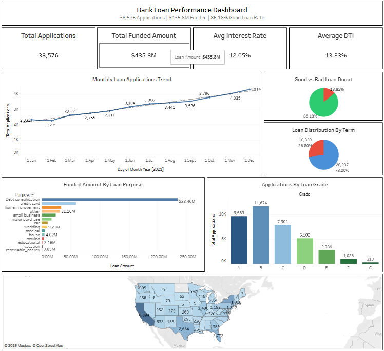
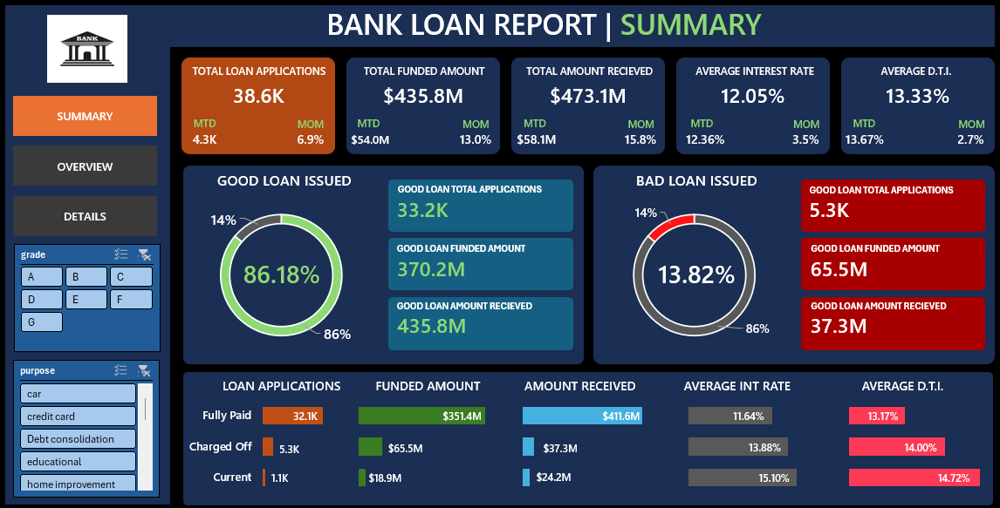
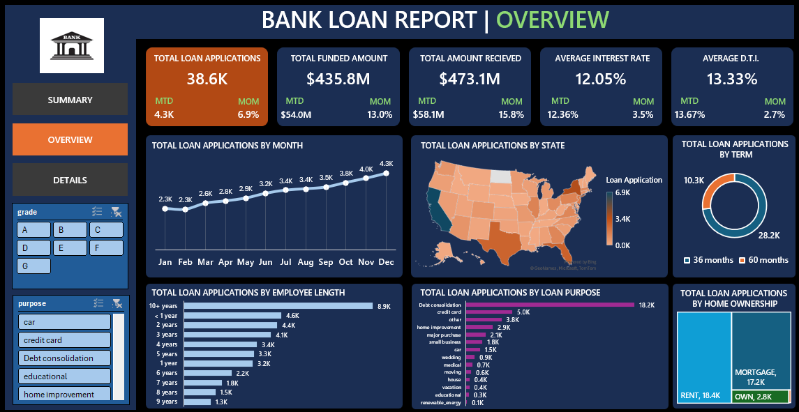
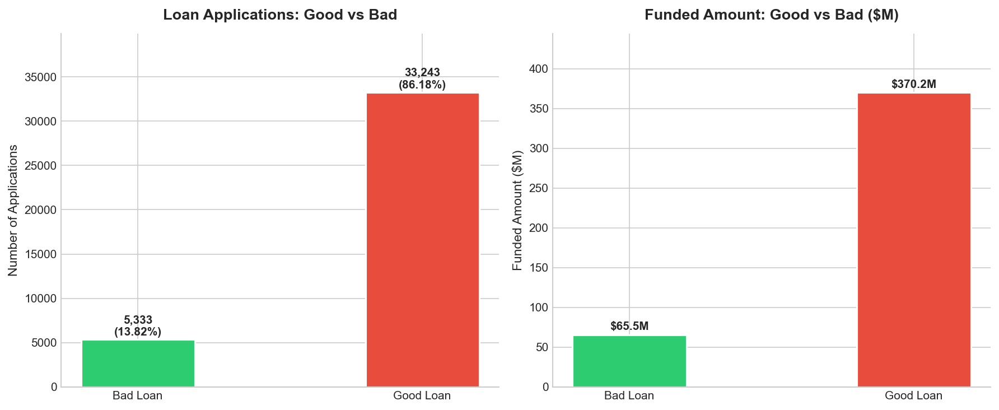
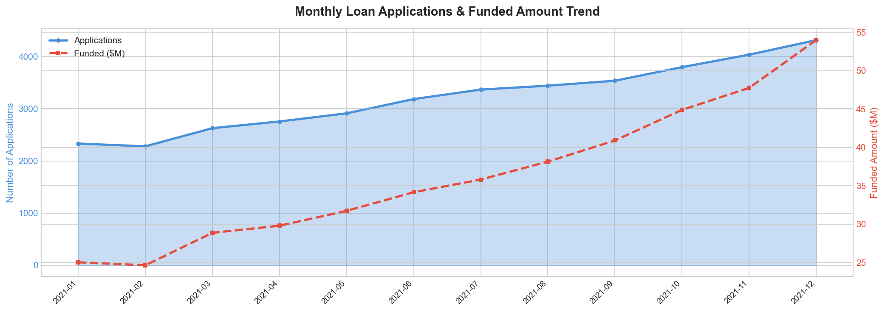
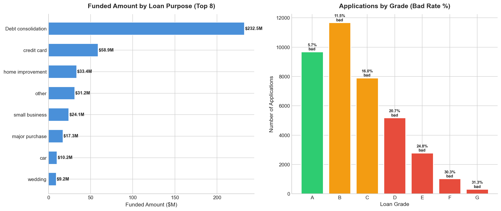

# Bank Loan Performance Analysis
### End-to-end analysis of 38,576 loan applications using SQL, Python, Excel, and Tableau

---

## Live Dashboard

[View Interactive Tableau Dashboard](https://public.tableau.com/views/BankLoanPerformanceDashboard/Dashboard1)

---

## Business Problem

Banks need to continuously monitor the health of their loan portfolio to make
data-driven lending decisions, manage risk exposure, and track repayment performance.

This project builds a comprehensive Bank Loan Report that answers:

- What is the overall health of the loan portfolio?
- What percentage of loans are performing (Good) vs defaulting (Bad)?
- How have loan applications and funded amounts trended month over month?
- Which loan purposes, grades, and states carry the highest volume and risk?
- What KPIs should the lending team track daily — MTD, PMTD, and MoM?

---

## Dataset

| Property | Value |
|----------|-------|
| Records | 38,576 loan applications |
| Features | 25 (loan status, funded amount, interest rate, DTI, grade, purpose, state, term, etc.) |
| Time Period | January 2021 — December 2021 |
| Source | Financial institution loan records |

---

## Project Structure

~~~
Bank-Loan-Analysis/
├── Data/
│   ├── financial_loan.csv
│   └── financial_loan.xlsx
├── Notebook/
│   └── Bank_Loan_Analysis.ipynb
├── SQL/
│   └── Bank_Loan_Analysis.sql
├── Images/
│   ├── 01_good_vs_bad_loans.png
│   ├── 02_monthly_trend.png
│   ├── 03_purpose_and_grade.png
│   ├── 1.png
│   ├── 2.png
│   └── Tableau_Dashboard.png
└── README.md
~~~

---

## Methodology

### 1. SQL Analysis (MySQL)
Designed and created a normalized `bank_loan` table with 25 fields. Wrote
business-focused queries to calculate all core KPIs including MTD, PMTD, and
MoM metrics using window functions, LAG(), and aggregations. Covered:
- Total loan applications, funded amount, and amount received with MoM trends
- Good vs bad loan segmentation based on loan status
- Loan status grid view with all performance metrics
- Regional, grade, purpose, term, and employment-based breakdowns

### 2. Python EDA (Jupyter Notebook)
Built a full analysis notebook with pandas and matplotlib covering:
- Core KPI calculation (applications, funded, received, interest rate, DTI)
- Good vs bad loan profiling with funded amount and recovery rate
- Monthly trend analysis with MoM % change
- Loan purpose breakdown by funded amount (top 8)
- Grade-wise application count with bad rate % overlay

### 3. Excel Dashboard
Engineered KPI calculations using pivot tables and custom Excel formulas.
Built two interactive dashboards — Summary and Overview — tracking MTD,
PMTD, and MoM metrics across all loan performance dimensions including
good vs bad loan ratios, loan status breakdown, and borrower segmentation.

### 4. Tableau Dashboard
Built an interactive 10-sheet dashboard published to Tableau Public:
- KPI cards (Total Applications, Funded Amount, Interest Rate, DTI)
- Monthly loan applications trend with trend line
- Good vs bad loan donut chart
- Loan term distribution (36 vs 60 months)
- Funded amount by loan purpose
- Applications by loan grade with color-coded risk
- US state map of loan distribution
- Interactive filters by loan status and grade

---

## Key Results

### Core KPIs

| Metric | Value |
|--------|-------|
| Total Loan Applications | 38,576 |
| Total Funded Amount | $435.8M |
| Total Amount Received | $473.1M |
| Net Position | +$37.3M |
| Average Interest Rate | 12.05% |
| Average DTI | 13.33% |
| MTD Applications (Dec) | 4,314 |
| MoM Growth (Dec) | +7.1% |

### Good vs Bad Loan Analysis

| Category | Applications | % of Total | Funded Amount | Received | Recovery Rate |
|----------|-------------|------------|---------------|----------|---------------|
| Good Loans (Fully Paid + Current) | 33,243 | 86.18% | $370.2M | $435.8M | 117.7% |
| Bad Loans (Charged Off) | 5,333 | 13.82% | $65.5M | $37.3M | 56.9% |

### Loan Status Breakdown

| Loan Status | Applications | Funded | Received | Avg DTI | Avg Int Rate |
|-------------|-------------|--------|----------|---------|-------------|
| Fully Paid | 32,145 | $351.4M | $411.6M | 13.17% | 11.64% |
| Charged Off | 5,333 | $65.5M | $37.3M | 14.00% | 13.88% |
| Current | 1,098 | $18.9M | $24.2M | 14.72% | 15.10% |

### Grade Risk Analysis

| Grade | Applications | Bad Rate |
|-------|-------------|----------|
| A | 9,689 | 5.7% |
| B | 11,674 | 11.5% |
| C | 7,904 | 16.0% |
| D | 5,182 | 20.7% |
| E | 2,786 | 24.8% |
| F | 1,028 | 30.3% |
| G | 313 | 31.3% |

### Top Loan Purposes by Funded Amount

| Purpose | Funded Amount |
|---------|--------------|
| Debt Consolidation | $232.5M (53.3%) |
| Credit Card | $58.9M |
| Home Improvement | $33.4M |
| Other | $31.2M |
| Small Business | $24.1M |

---

## Visualizations

### Tableau Dashboard (Interactive — click to explore)

### Excel Summary Dashboard

### Excel Overview Dashboard

### Python — Good vs Bad Loan Analysis

### Python — Monthly Trend Analysis

### Python — Loan Purpose & Grade Analysis

---

## Business Recommendations

**Recommendation 1 — Tighten underwriting for Grade D-G loans**

Grade D through G loans have bad rates ranging from 20.7% to 31.3%, representing
significant default risk. These grades account for a disproportionate share of
the $65.5M bad loan exposure.
Action: Implement stricter DTI thresholds (below 15%) and mandatory income
verification for Grade D-G applicants. Consider reducing maximum loan amounts
for these risk tiers until repayment performance improves.

**Recommendation 2 — Expand the Debt Consolidation segment**

Debt consolidation is by far the largest segment at $232.5M funded — 53.3% of
total portfolio — and Grade A debt consolidation loans have only a 5.7% bad rate.
Action: Prioritize marketing campaigns targeting debt consolidation borrowers
with Grade A-B profiles. This segment has demonstrated strong repayment behavior
and should be the primary growth driver for the next lending cycle.

**Recommendation 3 — Incentivize 36-month terms over 60-month terms**

26.8% of loans (10,339) are on 60-month terms which carry higher default risk
due to longer repayment windows and greater income uncertainty over time.
Action: Offer a 0.5% interest rate reduction for borrowers who choose 36-month
terms. This reduces portfolio default risk while remaining competitive in pricing.

---

## Tools Used

| Tool | Purpose |
|------|---------|
| MySQL | Table creation, KPI queries, MTD/MoM analysis, segmentation |
| Python / pandas | EDA, trend analysis, good vs bad profiling |
| matplotlib / seaborn | Python visualizations |
| Microsoft Excel | KPI engineering, pivot tables, interactive dashboards |
| Tableau Public | Interactive 10-sheet dashboard with live filters |
| Jupyter Notebook | Analysis environment |

---

*Analysis by Parshwa Gandhi 

